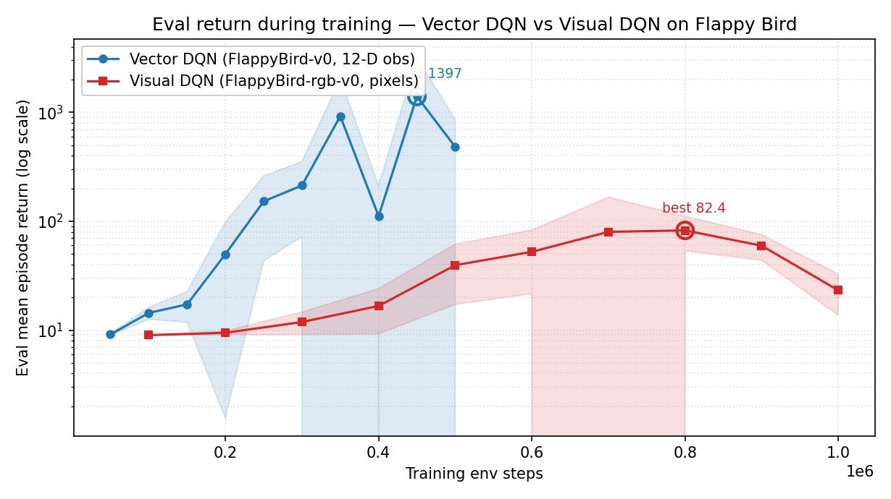
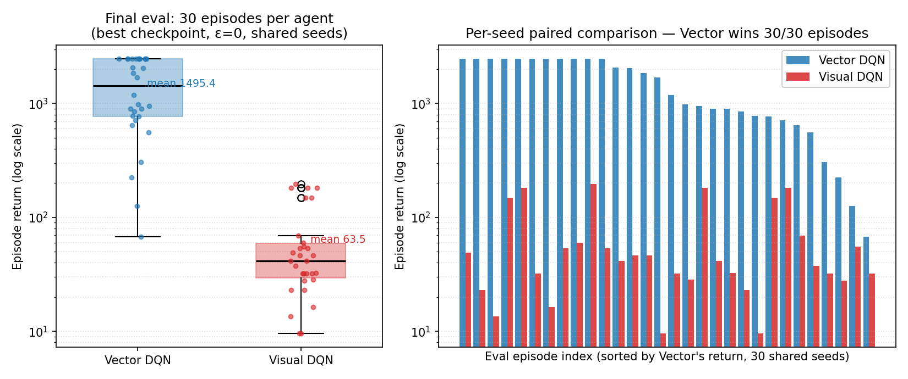

# DQN — Vector vs Visual Deep Q-Networks on Flappy Bird

[](https://colab.research.google.com/github/caochengrui/DQN/blob/main/DQN.ipynb)
[](https://www.python.org/downloads/)
[](https://pytorch.org/)

A modular Deep Q-Network (DQN) implementation built with [Gymnasium](https://gymnasium.farama.org/) and [PyTorch](https://pytorch.org/), used as a small case study on a question that comes up often in RL:

> **Given the same task and the same training budget, should you learn from a small feature vector or from raw pixels?**

The repository implements both ends of that question and runs them against each other on Flappy Bird:

- **Vector DQN** — a 2-hidden-layer `QNetwork` (MLP) over the 12-D feature observation of `FlappyBird-v0`. Hand-written training loop in [DQN.ipynb](DQN.ipynb).
- **Visual DQN** — a Nature-DQN-style `CNNQNetwork` over the 84×84 grayscale pixel stack of `FlappyBird-rgb-v0`. Batteries-included trainer in [`DQN/train_flappy.py`](DQN/train_flappy.py) with Double DQN, Huber loss, gradient + reward clipping, warmup, and uint8 replay.

A unified "fair comparison" cell at the end of the notebook scores both trained agents on the **same 30 reset-seeded episodes** with ε=0, loading each agent's **best-by-evaluation checkpoint**, and prints a side-by-side table.

---

## Table of Contents

- [Algorithm](#algorithm)
- [Project Structure](#project-structure)
- [Installation](#installation)
- [Public API](#public-api)
- [Quick Start](#quick-start)
- [Visual Observation Pipeline](#visual-observation-pipeline)
- [Findings — Vector DQN vs Visual DQN on Flappy Bird](#findings--vector-dqn-vs-visual-dqn-on-flappy-bird)
- [Reproducibility](#reproducibility)
- [Scope and Limitations](#scope-and-limitations)
- [Acknowledgements](#acknowledgements)

---

## Algorithm

The standard DQN target for a non-terminal transition:

$$
y_t = r_t + \gamma (1 - d_t) \max_{a'} Q_{\text{target}}(s_{t+1}, a')
$$

Both training loops in this repository implement the same skeleton:

1. collect transitions with an ε-greedy policy
2. store them in the replay buffer (`uint8` storage for image stacks)
3. sample a mini-batch, compute the TD target with the target network
4. one gradient step on the online network
5. periodically synchronize the target network
6. periodically evaluate the policy and checkpoint

`DQN/train_flappy.py` adds the ingredients pixel-based DQN actually needs and that the notebook's hand-written vector loop omits:

- **Double DQN** — next action chosen by the online network, evaluated by the target network. Removes the systematic Q-value overestimation that destabilises pixel training.
- **Huber (smooth L1) loss** — robust to the large TD errors early in pixel training.
- **Gradient-norm clipping** — caps occasional huge updates.
- **Reward clipping** — keeps the TD target scale consistent.
- **Warmup + `train_freq`** — one gradient step every few env steps, *after* a warmup phase, instead of an update on (almost) every step.
- **uint8 replay + GPU-side normalization** — so a 100k image stack fits in RAM.

Time-limit truncations are handled by resetting the env during data collection rather than stored as absorbing terminal states (the replay buffer only stores `terminated` flags).

---

## Project Structure

```text
DQN/
├── DQN/                        # Core package
│   ├── __init__.py             # Public package exports
│   ├── collect_data.py         # ε-greedy action selection + one-step collection
│   ├── evaluation.py           # evaluate_policy (returns per-episode returns)
│   ├── q_network.py            # QNetwork (MLP) + CNNQNetwork (Nature-DQN CNN)
│   ├── replay_buffer.py        # NumPy ring buffer + torch batch container
│   ├── wrappers.py             # SkipEnv / Grayscale / Resize / FrameStack + make_flappy_env
│   └── train_flappy.py         # Tuned visual-DQN trainer + record_video (also a CLI)
├── DQN.ipynb                   # End-to-end notebook (vector + visual + fair comparison)
├── assets/                     # README charts + plot generator
├── custom_utils.py             # Notebook helper for displaying recorded videos
├── pyproject.toml              # Packaging, dependencies, tooling
└── README.md
```

---

## Installation

```bash
# from a Colab cell
!pip install "git+https://github.com/caochengrui/DQN.git"

# or local clone for development
git clone https://github.com/caochengrui/DQN.git
cd DQN
pip install -e .
```

For Flappy Bird (both observation types) you also need the optional environment package:

```bash
pip install "flappy-bird-gymnasium @ git+https://github.com/araffin/flappy-bird-gymnasium@patch-1"
```

For video recording install `ffmpeg` (Debian/Ubuntu/Colab: `sudo apt-get install -y ffmpeg`; macOS: `brew install ffmpeg`).

**Core runtime deps** (`pyproject.toml`): Python ≥ 3.8, PyTorch ≥ 2.4.0, Gymnasium ≥ 0.29.1 (< 1.1.0) with `classic-control` and `other` extras, NumPy, scikit-learn, opencv-python ≥ 4.6.0.

---

## Public API

Re-exported from the package root:

| Symbol | Purpose |
| --- | --- |
| `QNetwork` | MLP for discrete-action environments with 1D `Box` observations |
| `CNNQNetwork` | Nature-DQN CNN for channels-first `(C, H, W)` `uint8` image stacks |
| `ReplayBuffer` | Ring-buffer replay storage (stores obs + next_obs as `uint8`) |
| `epsilon_greedy_action_selection`, `collect_one_step`, `linear_schedule` | Vector-DQN training loop helpers |
| `SkipEnv`, `GrayscaleWrapper`, `ResizeWrapper`, `FrameStack` | Flappy Bird preprocessing wrappers |
| `make_flappy_env` | Factory for the `FlappyBird-rgb-v0` visual pipeline |

The visual trainer is imported explicitly (`from DQN.train_flappy import ...`) so `python -m DQN.train_flappy` runs without a runpy double-import warning:

- `train` — the tuned pixel-DQN training loop
- `record_video` — roll out a trained agent and save MP4s via OpenCV
- `evaluate`, `get_device`

The evaluation helper `DQN.evaluation.evaluate_policy` (used in the notebook's vector path) now returns a 1-D `np.ndarray` of per-episode returns, so the training loop can detect a new best mean and save a `*_best.pth` checkpoint automatically.

---

## Quick Start

### Vector DQN

```python
import gymnasium as gym
import torch as th
from torch import optim
import torch.nn.functional as F

from DQN import QNetwork, ReplayBuffer, collect_one_step, linear_schedule

env = gym.make("CartPole-v1")
obs, _ = env.reset()

q_net = QNetwork(env.observation_space, env.action_space)
target = QNetwork(env.observation_space, env.action_space)
target.load_state_dict(q_net.state_dict())

opt = optim.Adam(q_net.parameters(), lr=1e-3)
replay = ReplayBuffer(100_000, env.observation_space, env.action_space)

for step in range(20_000):
    eps = linear_schedule(1.0, 0.05, step, 10_000)
    obs = collect_one_step(env, q_net, replay, obs, exploration_rate=eps)
    if replay.current_idx < 32 and not replay.is_full:
        continue

    batch = replay.sample(32).to_torch()
    with th.no_grad():
        next_q = target(batch.next_observations).max(dim=1).values
        td_target = batch.rewards + 0.99 * next_q * (~batch.terminateds)
    current_q = q_net(batch.observations).gather(1, batch.actions).squeeze(1)
    loss = F.mse_loss(current_q, td_target)
    opt.zero_grad(); loss.backward(); opt.step()

    if step % 500 == 0:
        target.load_state_dict(q_net.state_dict())
```

### Visual DQN on Flappy Bird (pixels)

The visual path ships a complete, tuned trainer — you don't write the loop yourself:

```python
from DQN.train_flappy import train, record_video

q_net = train(
    env_id="FlappyBird-rgb-v0",
    total_timesteps=1_000_000,   # 2M game frames at frame_skip=2; ~45-60 min on an L4 GPU
    buffer_size=100_000,         # ~5.6 GB RAM at (4, 84, 84) uint8
    learning_starts=20_000,
    frame_skip=2,
    frame_stack=4,
    double_dqn=True,
    device="auto",               # CUDA -> Apple MPS -> CPU
)

# Save MP4s of the full-resolution game played by the trained agent.
# By default it writes both the final weights and the best-by-evaluation
# checkpoint (logs/checkpoint/visual_dqn_flappy_best.pt) to disk.
record_video(q_net, env_id="FlappyBird-rgb-v0", video_folder="logs/videos")
```

Or run as a script (useful on remote GPU boxes):

```bash
python -m DQN.train_flappy --smoke                       # ~30s pipeline sanity check
python -m DQN.train_flappy --total-timesteps 1000000     # full run
```

For the end-to-end workflow including the **fair-comparison cell** that produces the numbers in the [Findings](#findings--vector-dqn-vs-visual-dqn-on-flappy-bird) section, see [DQN.ipynb](DQN.ipynb).

---

## Visual Observation Pipeline

`make_flappy_env` builds the preprocessing pipeline for pixel-based Flappy Bird DQN. The base env is `FlappyBird-rgb-v0`, whose observation is already the rendered RGB game screen — no "render to pixels" wrapper is needed. The wrappers are applied in order:

```
raw RGB (H, W, 3) uint8
  → SkipEnv               action repeat, summed reward, no max-pooling (only if frame_skip > 1)
  → GrayscaleWrapper      RGB → grayscale (H, W) uint8
  → ResizeWrapper         → (84, 84) uint8
  → FrameStack            → channels-first (frame_stack, 84, 84) uint8     <- CNN input contract
  → RecordEpisodeStatistics
```

`FrameStack` always emits a contiguous channels-first array, so the same format goes through the replay buffer and into `CNNQNetwork` (which detects the `uint8` dtype and normalizes to `[0, 1]` on the GPU inside `forward`). `make_flappy_env` also sets `SDL_VIDEODRIVER=dummy` / `SDL_AUDIODRIVER=dummy` and passes `audio_on=False` to the env, so it runs headlessly on Colab / GPU servers without a display or sound device.

The video recorder (`record_video`) writes MP4s of the **full-resolution** game screen via OpenCV (`cv2.VideoWriter`, no `moviepy` dependency), transposing pygame's `(W, H, 3)` surfarray layout to image-style `(H, W, 3)` so the video is correctly oriented.

---

## Findings — Vector DQN vs Visual DQN on Flappy Bird

Both agents were trained on the same game on an NVIDIA L4 GPU (seed 2026), then scored on the **same 30 reset-seeded episodes** with ε=0, each loading its **best-by-evaluation checkpoint**.

```
Vector DQN  | n=30 | mean 1495.42 | median 1439.25 | std 882.72 | min 67.90 | max 2476.10
Visual DQN  | n=30 | mean   63.55 | median   41.50 | std  57.18 | min  9.60 | max  195.50
```

**Vector DQN wins on every single one of the 30 paired episodes (30/30).** It is ~24× the mean return of Visual DQN. In 11/30 episodes Vector hit the 20,000-step per-episode safety cap (`max_steps`), so Vector's true ceiling is even higher than 2476.

### Learning curves during training



Each marker is one periodic eval (5-episode mean ± std, ε=0). The hollow ring marks each agent's best eval — the weights saved as `*_best.{pth,pt}` and used for the final 30-episode comparison.

Things worth noticing:

- **Vector DQN learns much faster** but is **unstable**: its eval bounces between ~100 and ~1400 across nearby checkpoints (no Double DQN / Huber loss in the vector loop). Without saving the best checkpoint, the last-step weights would dramatically under-represent the agent.
- **Visual DQN learns slowly and steadily**, peaks at ~82 at step 800k, then **catastrophically forgets** — the final 1M eval drops back to 23.22. This is the textbook DQN failure mode that motivates Double DQN / dueling DQN / prioritized replay in stronger pixel-DQN setups.
- **Even at peak, Visual DQN is ~17× below Vector's mean.**

### Final fair-comparison distribution



The left plot shows the per-episode return distribution (30 episodes per agent, individual points overlaid). The right plot pairs each agent's return on the *same* seeds, sorted by Vector's return — Visual's red bar never crosses Vector's blue one.

### Why does Vector win, and is this what theory predicts?

**Yes — Vector winning is exactly what theory predicts at this training budget.** Several angles say the same thing:

1. **Information theory.** The 12-D `FlappyBird-v0` feature vector is a **sufficient statistic** for the MDP — it already encodes the bird's y / y-velocity and the next pipes' x / y bounds. From the same game state, `FlappyBird-rgb-v0` returns 4 × 84 × 84 = 28,224 bytes of grayscale pixels that *contain* those 12 numbers, but mixed in among everything else. The pixel agent has to learn the inverse rendering before it can learn the policy. That extra learning is the **representation-learning tax**.

2. **Sample complexity.** DeepMind's Nature DQN takes **10M–200M frames** to reach human-level play on Atari from pixels. Vector-state baselines on the same games typically need **< 1M**. Our 1M-frame visual budget here is short by an order of magnitude or more *by Atari standards*. The agent is still learning at step 800k (rising eval), which is consistent with that gap.

3. **Function approximation.** The MLP needs to learn `Q : R^12 → R^2`. The CNN needs to learn `Q : [0, 255]^{28224} → R^2`, restricted to the low-dimensional manifold of game screens that the renderer can actually produce. The latter is unsupervised representation learning *nested inside* RL — and the only signal driving it is the same sparse reward.

4. **Empirical history.** Whenever practical RL has access to a structured state (game RAM, simulator API), it uses it. AlphaStar and OpenAI Five both started from structured state and only later trained on screen pixels. The "pixels are richer so they must be better" intuition fails because in RL, *richer input = more representation learning required = more samples needed*.

#### When *would* Visual DQN beat Vector DQN?

- The vector observation is incomplete or noisy and pixels carry strictly more information.
- The task requires perception that's outside the vector (recognizing objects, colors, text).
- Training budgets are very different (e.g. 100M frames for the pixel agent vs 100k for the vector agent).
- Evaluation tests **generalisation** to visual variants (different bird sprites, different backgrounds) that the pixel agent can see and the vector agent has no input for.

None of those apply to FlappyBird-v0 / FlappyBird-rgb-v0 at equal compute, which is why the observed gap is so large.

### Why we report the best checkpoint, not the last-step weights

Two reasons that the learning curves above make obvious:

- The vector DQN's eval is **unstable** in the late phase (peak 1397 at step 450k → 482 at step 500k). Using last-step weights underestimates the trained agent by ~3×.
- The visual DQN **forgets** after its peak (82.4 at step 800k → 23.2 at step 1M). Using last-step weights would make Visual DQN look ~3.5× worse than it actually achieved during training.

The `run_dqn` notebook function and `DQN.train_flappy.train` both now write a `*_best.pth` / `*_best.pt` checkpoint whenever the mean eval return improves, and the comparison cell loads those. This is the single biggest methodological change between this run and the looser "test cell" eval in the notebook's per-section evaluations.

---

## Reproducibility

The numbers above come from one training seed per agent on an L4 GPU. To reproduce on Colab end-to-end, just run [DQN.ipynb](DQN.ipynb) cells top-to-bottom — vector DQN takes ~10 min, visual DQN takes ~45–60 min, the comparison cell takes ~5 min on top.

The training logs and the per-episode comparison data are checked in under [`assets/data/`](assets/data/) (`vector_train.log`, `visual_train.log`, `comparison_returns.npz`). To regenerate the charts in this README from that data — or from a fresh run after dropping new files into `assets/data/`:

```bash
python3 assets/plot_results.py
```

**Caveat — single seed.** A publication-grade comparison would re-train each agent under 3–5 seeds and average across runs. Within one Colab session that is impractical, so this report fixes seed = 2026 and instead **stabilises evaluation** (best checkpoint, 30 shared eval seeds, ε=0) to extract the most reliable signal from a single training seed. The qualitative direction of the gap is robust to seed choice; the exact ratio is not.

---

## Scope and Limitations

Designed for **discrete-action** Gymnasium environments.

Supported out of the box:

- 1D `spaces.Box` observations (e.g. `CartPole-v1`) — Vector DQN
- the feature-vector `FlappyBird-v0` — Vector DQN
- the pixel-based `FlappyBird-rgb-v0` — Visual DQN

Important boundaries:

- the action space must be `spaces.Discrete`
- `QNetwork` expects 1D vector observations; `CNNQNetwork` expects channels-first `(C, H, W)` `uint8` image stacks (produced by `make_flappy_env`)
- the visual pipeline is intentionally **Flappy-Bird-focused**; CartPole is *not* supported as a visual task — rendering CartPole to pixels discards the exact state that makes it learnable. This is the design rule "do not cross-wire the two paths"
- no continuous control
- dueling DQN and prioritized replay are **not** included (Double DQN is, in the visual trainer)

The CNN and wrappers can be adapted to other pixel environments, but `make_flappy_env` targets `FlappyBird-rgb-v0` specifically.

---

## Acknowledgements

- Based on the [RLSS 2023 DQN tutorial](https://github.com/araffin/rlss23-dqn) by [Antonin Raffin](https://github.com/araffin).
- Some hyperparameter choices are inspired by the [RL Baselines3 Zoo](https://github.com/DLR-RM/rl-baselines3-zoo).
- The optional Flappy Bird environment uses the [patch-1 fork of flappy-bird-gymnasium](https://github.com/araffin/flappy-bird-gymnasium/tree/patch-1).
